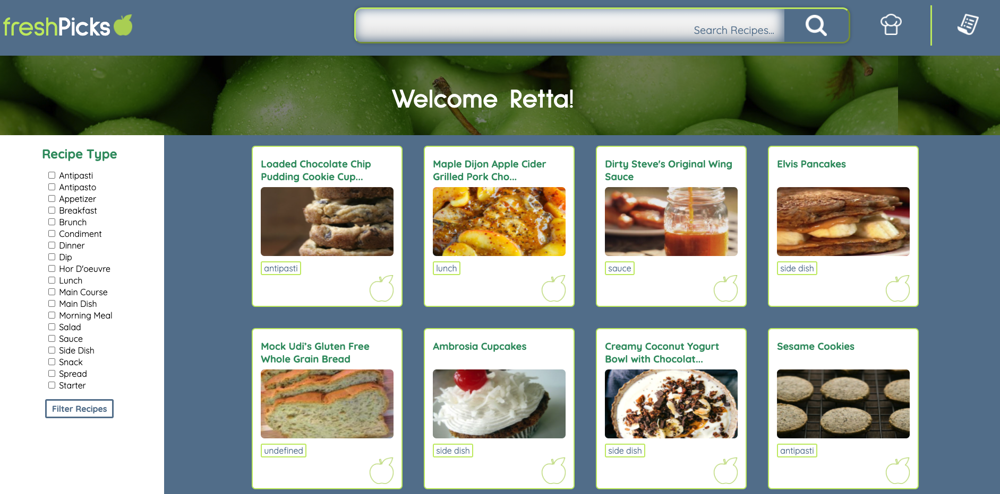
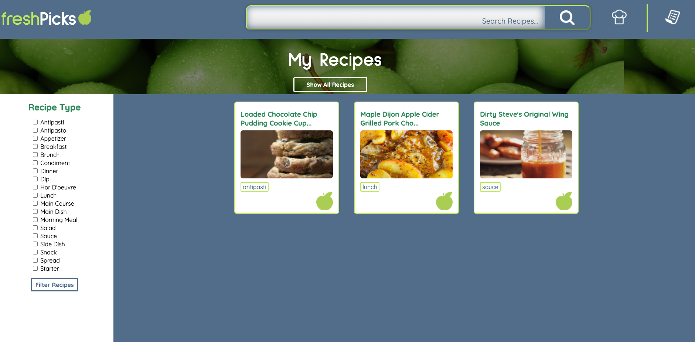
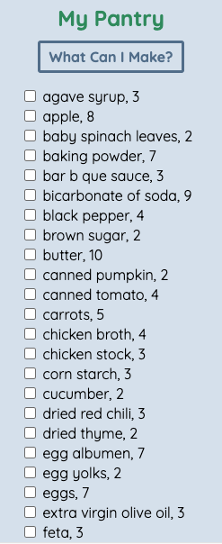

# Title: Refactor Tractor B

A [Front-End Project] by [Robert DeRouin](https://github.com/robertjosephderouin) & [Peter Muellerleile](https://github.com/pcmueller) & [Jon Schlandt](https://github.com/jon-schlandt)

* Project Manager: [Travis Rollins](https://github.com/Kalikoze)

1. [Overview](#overview)
2. [Functionality](#functionality)
3. [Iterations](#iterations)
4. [Technologies](#technologies)
5. [Contributors](#contributors)
6. [Resources](#resources)

## Overview

The refactor tractor project refactors the Whats Cooking website to follow single use protocol, address accessability concerns in the HTML, & and dry up the code by utilizing inheritance and better class structure.

### Deployed Page
* [GitHub Hosted URL](https://pcmueller.github.io/refactor-tractor/)

## Main Page View

## Saved Recipes View

## Pantry View

## Functionality

* Current:
  * User can navigate between three views. "Saved Recipes", "Welcome Screen", and "Pantry".
  * User can save their favorite recipes to the "saved recipes" by clicking on the apple where itwill be added to an array displayed in a grid format.
  * User can delete any recipes in the "saved recipes" view by clicking on the apple icon.

## Technologies

1. HTML
2. CSS
3. JavaScript
4. GitHub (website hosting and source code management)
5. Webpack
6. Sassy CSS

## Contributors

* Creator: [Robert DeRouin](https://github.com/robertjosephderouin)
* Creator: [Peter Muellerleile](https://github.com/pcmueller)
* Creator: [Jon Schlandt](https://github.com/jon-schlandt)
* Project Manager: [Travis Rollins](https://github.com/Kalikoze)

## Resources

* [Project Description](https://frontend.turing.io/projects/module-2/refactor-tractor-wc.html)
* [Team GitHub Repo](https://github.com/robertjosephderouin/refactortractor)
* [GitHub Hosted URL](https://pcmueller.github.io/refactor-tractor/)
